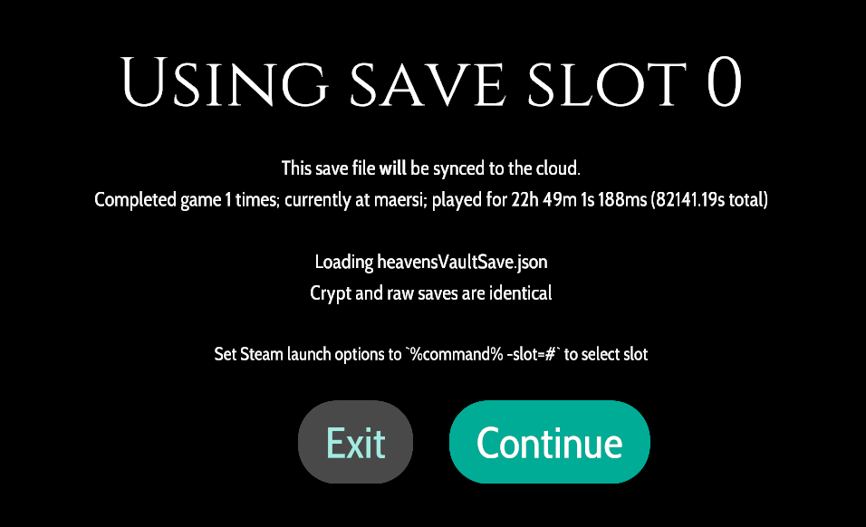
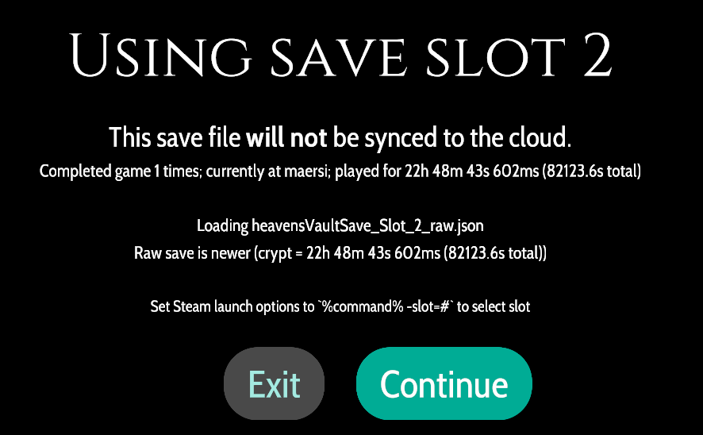
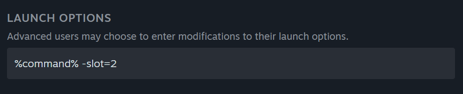

# ruinvault

ruinvault is a mod for [Heaven's Vault](https://store.steampowered.com/app/774201/Heavens_Vault/).

Currently most patches are around speeding up the gameplay to make additional
playthroughs less monotonous.

It also enables a multiple save slot feature (requires restarts) and easy save file editing.

It's called `ruinvault` because you find ruins in-game, but also because if you use this before beating the game you could potentially ruin your experience.

Behind the scenes `ruinvault` uses the [BepInEx](https://github.com/BepInEx/BepInEx) mod framework.




## Installation

### Common

Extract the distribution zip to the game's directory. No files will be overwritten.

```
"C:\Program Files (x86)\Steam\steamapps\common\Heaven's Vault"
```

```
"/home/deck/.steam/steam/steamapps/common/Heaven's Vault"
```

### Steam Deck

> [!IMPORTANT]
> Without this step Heaven's Vault mods will not run on the Steam Deck.

- Edit the game's launch options to read
  ```shell
  ./hv.sh %command% -slot=0
  ```
  
  You can ignore `-slot=0` if you don't want to use multiple save slots.

## Usage

Run the game normally.

> [!NOTE]
> You must run the game from Steam if you want achievements to register.

## Features:

#### Multiple Save Files

##### Save Slots

To select a save slot, edit the game's launch options to add a `slot=` argument:

```shell
# For Steam Deck
./hv.sh %command% slot=2
```

or

```shell
# For Windows
%command% slot=2
```



##### Save Editing & DevSaves

Save files have an associated `_raw.json` file that can be freely modified
when the game is not running. The game will compare the time played (`totalPlayTime` field)
between the raw version and the crypted version to select which version to load.

This built-in DevSave system is also enabled. This system frequently saves raw
saves to the `DevSaves` folder and can act as backup save files. These are never
loaded by default - see [saves.md](docs/saves.md) for details.

### Visuals

- Removed ghost trails of player and other characters

### Gameplay

#### Fast Screen Transitions

- Load screens that fade to/from black screens are much faster.
- Quote screens (start of game; change location text) now display text immediately and let you continue immediately.
- Title and splash screens are skipped 
- Story scenes can be skipped by `left clicking` (only). This is untested.

#### Fast Movement & Animation Hotkey

> [!IMPORTANT]
> Hold `shift` to vastly increase walk speed and animations.

> [!TIP]
> Bind `shift` to a button with Steam Input.
> I suggest `L4` and making it a `toggle` button.

#### River Teleportation & Tweaks

- Use gamepad `X` or `right click` while using the map and sailing to
  instantly teleport to a specific river.
- The prompt to give sailing control to your robot appears nearly instantly.
- You can now exit the sailing map without setting a destination.
- The time before a reset prompt coming up when missing a return has decreased.
- The minimum speed on rivers has been increased, but this is not well tested.
- Ruins appear a bit more frequently.

#### Cheats

There are a few built-in cheats enabled. See [cheats.md](docs/cheats.md) for more details.

#### Photo Mode / Free Camera

A free camera can be enabled. See [camera.md](docs/camera.md) for more details.

#### Disabled Options

The code must be recompiled to enable these; no friendlier config currently exists.

- Autoreset position on river when making a wrong turn off the path. Can result in infinite loops if current directs you to the wrong path.
- Skip startup quote screen.
- Skip all position-change summary screens.
- Autocontinue at all "continue" prompts.
- Show all rivers on map screen.

## Development & Build Notes

See [development.md](docs/development.md).